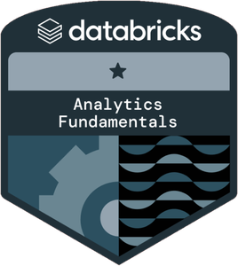

# Hi, I'm Jaivardhan Ranawat 👋

🎓 B.Tech IT @ Manipal University Jaipur '26  
📍 Delhi NCR, India  
📊 Aspiring Data Analyst — turning raw data into business decisions  
💼 Open to Data Analyst / Business Analyst roles

---

## 🛠️ Toolkit

---

## 🏅 Certifications

| Badge | Certification | Issuer | Verify |
|:---:|---|---|---|
|  | Azure Data Fundamentals (DP-900) | Microsoft | [View credential](https://learn.microsoft.com/api/credentials/share/en-us/JaivardhanRanawat-1975/F4CE3C22997F921F?sharingId=126C25F73382C62B) |
|  | Analytics Fundamentals (Academy Accreditation) | Databricks | [View credential](https://credentials.databricks.com/882d5428-9f25-457b-beca-685133e9b3d8) |

---

## 📂 Projects by Tool

### 📗 Excel
**Skills:** Dynamic arrays (FILTER, SORT, UNIQUE) · Power Query · Pivot Tables · KPI dashboards · Advanced charts · Data validation

### 🗄️ SQL
**Skills:** Joins · Subqueries & CTEs · Window functions · Pivot/Unpivot · String & regex functions · MySQL

### 🐍 Python
**Skills:** Pandas · NumPy · Data cleaning · Exploratory data analysis · Matplotlib / Seaborn

### 📈 Power BI
**Skills:** Data modelling · DAX (CALCULATE, time intelligence) · Power Query · What-if parameters · Report design

**[Global Airbnb Performance Dashboard](https://github.com/Jaivardhanr28-Data/Airbnb-Global-Performance-Powerbi)**: 279K listings · 5.4M reviews · 10 cities
- 📉 Tracked COVID-19 impact: demand fell **92%** in April 2020; Istanbul recovered fastest (**79%**)
- 💱 Converted prices from **10 currencies to USD** for fair comparison across cities
- 🧮 DAX: CALCULATE, RANKX Pareto analysis, MEDIANX + RELATED · Star schema with a custom Date table
- ⚡ Cut model size **204 MB → 20 MB (−90%)**

**[Uber Ride Analytics Dashboard](https://github.com/Jaivardhanr28-Data/Uber-Ride-Analytics-Powerbi)**: 150K bookings · 7 vehicle types · Delhi NCR
- 🚫 Found **38% of bookings lost**; driver cancellations (**18%**) are the single biggest leak
- 🔁 **79% of customers book only once**, so retention is the main growth lever
- 🚗 Dynamic vehicle image + synced button slicer across 5 pages; page-specific KPIs
- 🧮 DAX: customer segmentation (first-time / returning / regular), TOPN, tie-breaker ranking · Star schema with Calendar table

### 🔗 End-to-End Projects
*Projects combining multiple tools — e.g. SQL → Python → Power BI*

---

## 📫 Connect With Me

